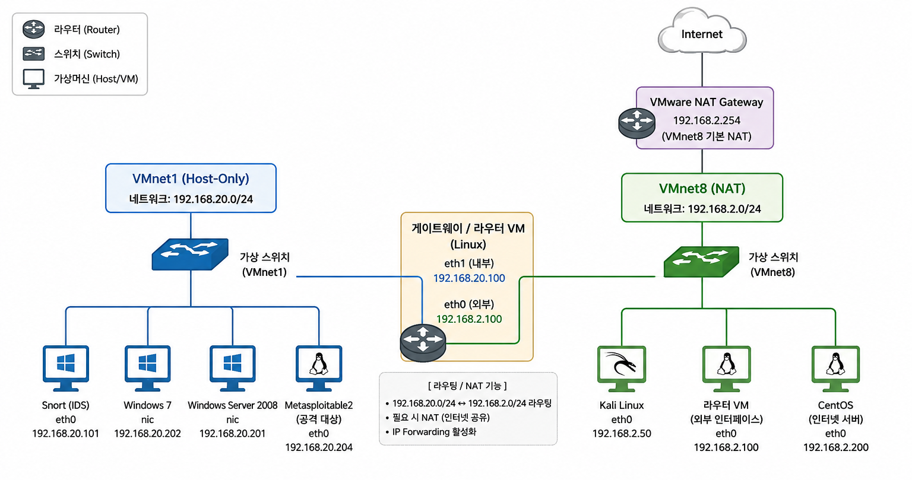

# VMware 기반 네트워크 보안 실습

형님IT 네트워크 보안 강의를 기반으로 VMware에서 다중 운영체제 실습망을 구축하고,
네트워크 프로토콜 분석, 스니핑·스푸핑, 네트워크 공격 및 방어 원리를 실습한 프로젝트입니다.

## 프로젝트 목표

- TCP/IP 네트워크 구조 이해
- VMware 기반 내부망·외부망 분리
- Wireshark를 이용한 패킷 분석
- ARP 및 DNS 스푸핑 원리 이해
- 네트워크 공격 트래픽 분석
- 방화벽과 IDS를 활용한 방어 방식 이해

## 실습 환경

- VMware Workstation Pro 17
- Kali Linux
- Windows 7
- Windows Server 2008 R2
- CentOS Stream 9
- Metasploitable2
- Snort
- Wireshark

## 네트워크 구성

- 내부망: VMnet1 Host-only `192.168.20.0/24`
- 외부망: VMnet8 NAT `192.168.2.0/24`
- 내부 게이트웨이: `192.168.20.100`
- 외부측 인터페이스: `192.168.2.100`
- VMware NAT Gateway: `192.168.2.254`

## 주요 실습

- Ethernet, ARP, IP, ICMP, TCP 패킷 분석
- Wireshark를 이용한 패킷 캡처
- ARP Spoofing과 MITM 구조 분석
- DNS 동작 및 Spoofing 원리 분석
- TCP·UDP 기반 공격 트래픽 분석
- Snort IDS를 이용한 탐지 구조 확인
- 라우팅 및 NAT 통신 경로 검증

## 상세 내용

실습 과정과 분석 내용은 [report.md](report.md)에 정리했습니다.

## 프로젝트 결과

단순히 공격 도구를 실행하는 데 그치지 않고,
패킷이 어떤 경로로 이동하며 각 공격이 네트워크 프로토콜을 어떻게 악용하는지 분석했습니다.

> 본 프로젝트는 개인이 소유한 격리된 가상 환경에서 교육 목적으로 수행했습니다.
